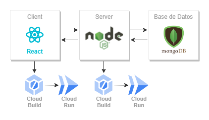

# Conectar Client Con Server Y MongoDB:

## Planteamiento:

>Desde el equipo de full-stack nos mandan una app web creada con react, node.js y mongoDB, con el front-end por un lado (client), y el back-end por otro(server). Nuestra tarea es desplegar la app en dos instancias de cloud run y lograr conectar el server con el client por un lado, y con mongoDB por otro.
>
>

## Resolución:

## Conectar server con base de datos:

Una vez creada la base de datos con MongoDB, utilizaremos *compass* para realizar la conexión con nuestra instancia. Para ello necesitamos que nuestro proveedor cloud tenga la cadena de conexión correspondiente de este estilo: `mongodb+srv://<username>:<password>@cluster0.2lnyz2p.mongodb.net/`. Esta contiene credenciales para la base de datos, por lo tanto, guardaremos esta cadena como un secreto en *secret manager*:


Hecho esto, podemos desarrollar el cloudbuild.yaml de la instancia *server*:

**cloudbuild_server.yaml**:

```yaml
steps:

- name: 'gcr.io/cloud-builders/gcloud'
  args: ['config', 'set', 'project', 'react-node-mongo-juan']

# Build the container image
- name: 'gcr.io/cloud-builders/docker'
  args: ['build', '-t', 'europe-west1-docker.pkg.dev/$PROJECT_ID/container-images/server-ejercicio:1.0', '-f', 'server/Dockerfile', '.']

# Push the container image to Container Registry
- name: 'gcr.io/cloud-builders/docker'
  args: ['push', 'europe-west1-docker.pkg.dev/$PROJECT_ID/container-images/server-ejercicio:1.0']

# Deploy container image to Cloud Run
- name: 'gcr.io/google.com/cloudsdktool/cloud-sdk'
  entrypoint: bash
  args: [
    "-c",
    "gcloud run deploy react-nodejs-cloudbuilds-server 
    --image=europe-west1-docker.pkg.dev/$PROJECT_ID/container-images/server-ejercicio:1.0 
    --region=europe-west1 
    --platform=managed 
    --allow-unauthenticated 
    --port=3000 
    --update-env-vars DB_URL_ATLAS=$$DB_URL_ATLAS"        # En el Dockerfile creamos la variable de entorno vacia, y aqui modificamos su valor con nuestro secreto
  ]
  
  secretEnv: [
    'DB_URL_ATLAS'
  ]

# Imagen localizada en el artifact registry de nuestro proyecto
images:
- 'europe-west1-docker.pkg.dev/$PROJECT_ID/container-images/server-ejercicio:1.0'

# Secreto creado en nuestro proyecto
availableSecrets:
  secretManager:
    - versionName: projects/368050493111/secrets/cadena-mongo/versions/latest
      env: 'DB_URL_ATLAS'
```

Si creamos el trigger en cloud build y hacemos un push, tendremos una instancia del server desplegada. Sin embargo, la conexión con la base de datos resulta fallida. Esto se debe a que nuestro Atlas no permite el acceso a la IP del server. Ya que las instancias en cloud run tienen una IP variable, permitiremos acceso a todas las IP:


## Conectar Server con Client

Una vez creado el server, necesitamos pasarle su URL al front-end. Nuestro client necesita la URL de la cloud run del back-end para dos operaciones: la creación de usuarios y la consulta de datos. Debemos modificar la variable `backendUrl` de los ficheros `Create.jsx` y `UserDatabase.jsx` en nuestra carpeta *client*, permitiendo asi al front-end realizar solicitudes al back-end:


Con la modificación de la URL podemos crear un segundo trigger para cloud build que ejecute el cloudbuild.yaml correspondiente:

**cloudbuild_client.yaml**:

```yaml
steps:

- name: 'gcr.io/cloud-builders/gcloud'
  args: ['config', 'set', 'project', 'react-node-mongo-juan']

# Build the container image
- name: 'gcr.io/cloud-builders/docker'
  args: ['build', '-t', 'europe-west1-docker.pkg.dev/$PROJECT_ID/container-images/client-ejercicio:1.0', '-f', 'client/Dockerfile', '.']

# Push the container image to Container Registry
- name: 'gcr.io/cloud-builders/docker'
  args: ['push', 'europe-west1-docker.pkg.dev/$PROJECT_ID/container-images/client-ejercicio:1.0']

# Deploy container image to Cloud Run
- name: 'gcr.io/google.com/cloudsdktool/cloud-sdk'
  entrypoint: bash
  args: [
    "-c",
    "gcloud run deploy react-nodejs-cloudbuilds-client 
    --image=europe-west1-docker.pkg.dev/$PROJECT_ID/container-images/client-ejercicio:1.0 
    --region=europe-west1 
    --platform=managed 
    --allow-unauthenticated 
    --port=5173 
    --update-env-vars DB_URL_ATLAS=$$DB_URL_ATLAS"
  ]

images:
- 'europe-west1-docker.pkg.dev/$PROJECT_ID/container-images/client-ejercicio:1.0'
```

¡Y con esto hemos logrado una aplicación web completamente funcional!
